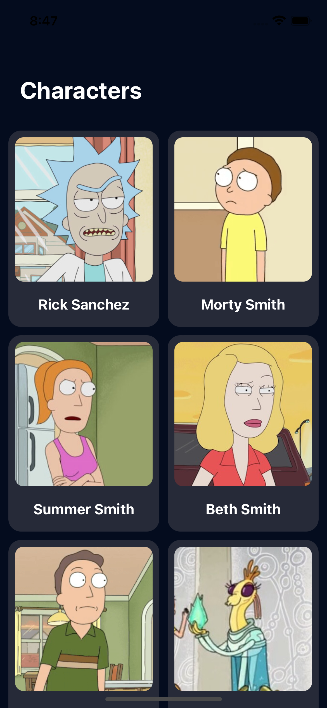
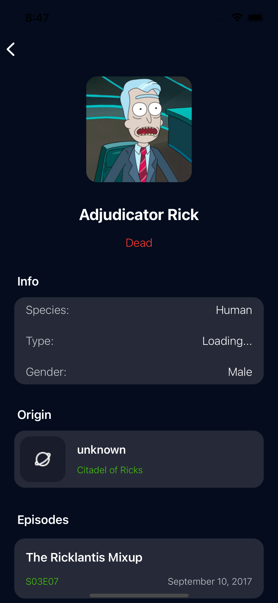

# 

Example of an app written calling [R&M Api](https://rickandmortyapi.com). 

## Used
- UIKit
- SwiftUI
- URLSession

## Demo

<table>
  <tr>
    <td>Main screen</td>
    <td>Detail screen</td>
  </tr>
  <tr> 
    <td></td>
    <td></td>
  </tr>
</table>

##  

https://github.com/elkraps/RaM/assets/116296991/35d12401-be32-411d-a94f-2bbe65dceba2

